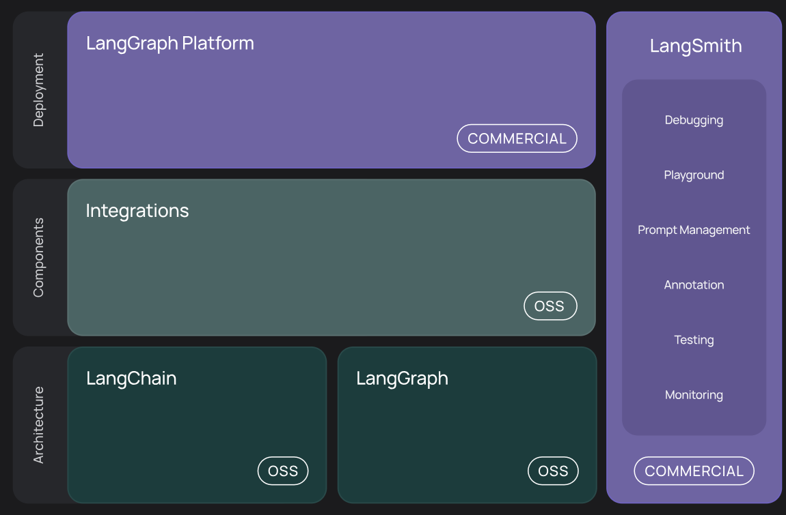

## LLM的缺陷
1. **偏见与深度理解不足**  
大模型依赖于大量数据进行训练但是这些数据具有偏向性，LLM在生成内容时可能会延续这些偏见，例如性别或种族刻板印象。此外，尽管模型能够生成流畅的文本，但它并不具备真正的深度理解能力，仅基于统计模式进行生成，缺乏逻辑推理和概念理解。
2. **特定领域知识的局限性**  
在医学、法律等专业领域，LLM的知识准确性有限，可能无法提供可靠的建议。此外，由于训练数据的时效性，模型对新知识或技术的掌握往往滞后，难以满足快速发展的领域需求。
3. **高资源需求与可解释性差**  
LLM的训练和推理需要大量的计算资源和存储空间，导致成本较高。同时，其内部机制复杂，难以解释生成结果的原因，这在某些需要透明性的场景中可能成为障碍。尽管存在这些缺点，LLM仍然是一个强大的工具，但在使用时需要结合人类的判断力和专业知识，以弥补其不足并最大化其优势。
4. **性能难以评估**  
当回答不准确的时候，没有具体的量化标准
5. **LLM无法处理模糊和复杂的任务**  
LLM的强项在于它可以处理明确、结构化的问题，但当问题变得模糊或者涉及复杂的推理时，它的表现就会大打折扣。
6. **事实准确性与一致性问题**  
LLM容易生成与事实不符的信息，出现所谓的“幻觉问题”。在回答问题或生成内容时，可能会编造不存在的事件或数据。此外，在处理长文本或多轮对话时，模型难以保持上下文一致性，可能导致前后矛盾的回答。例如有时你给LLM一个看似简单的问题，它却能给出一个完全错误的答案。比如，你问它：“世界上最高的山是什么？”它可能会回答“马尔科姆山”，这个名字根本不存在，但由于模型根据某些错误的训练数据生成了这个答案。
7. **推理与规划能力不足**  
LLM在因果推理和多步规划方面表现较弱。它们难以理解事件之间的因果关系，例如无法准确推断“如果不下雨，地面就不会湿”。此外，在处理复杂任务时，模型难以合理分解步骤并进行有效排序，导致规划结果不够实用。
8. **数值处理与计算能力有限**  
由于LLM的token化方式，对数值的理解和计算容易出错。例如，在比较数字或执行算术运算时，可能会因错误的处理方式得出不准确的结果。此外，模型缺乏真正的数值概念，无法像人类一样分析数量或比例问题。
9. **无状态性**：  
模型本身不记得之前的对话或交互。
## langchain出现的背景
主要是为了解决LLM的缺陷比如
1. 大模型的知识具有**滞后性**，如我今天出现的新闻大模型并没有学习到相关的知识，因此询问他会得到错误的结果
2. 大模型**只能生成文本**，不能够查询数据库，调用api,执行代码，不满足实际应用场景
3. 大模型具有**幻觉问题** ，会生成看似合理实际完全错误的信息
4. 大模型不能够深度理解没有记忆功能
## langchain 的特点
## langchain 架构

  

图1.1总体架构

  

图1.2技术架构

1. langchain-core：包含不同组件的基本抽象以及将他们组合在一起的方法， 此处定义了聊天模型、矢量存储、工具等核心组件的接口。 此处未定义第三方集成。 依赖项被故意保持非常轻量级。
2. langchain ：提供了构建应用程序认知架构所需的链和检索策略。这些链和检索策略是通用的，适用于所有集成，并允许用户轻松地构建复杂的认知流程。
集成：流行的集成有自己的包（例如 langchain-openai、langchain-anthropic 等），以便它们可以进行适当的版本控制和适当的轻量级
3. langchain-community :该包包含由 LangChain 社区维护的第三方集成。关键集成包被分离出来（见上文）。这包含各种组件（聊天模型、矢量存储、工具等）的集成。此包中的所有依赖项都是可选的，以使包尽可能轻量级。
4. langgraph :LangGraph 是 LangChain 的扩展，旨在通过将步骤建模为图中的边缘和节点，使用 LLM 构建健壮且有状态的多参与者应用程序。
5. langserve :用于将 LangChain 链部署为 REST API 的包。可以轻松启动和运行生产就绪的 API。 类似flaskapi
6. LangSmith : 一个开发人员平台，可让您调试、测试、评估和监控 LLM 应用程序