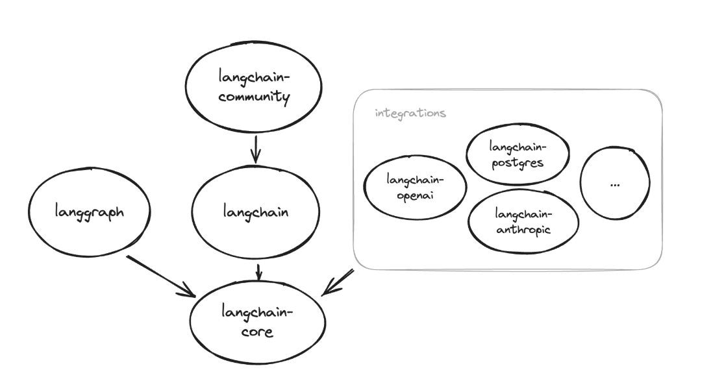
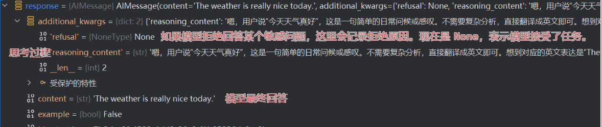
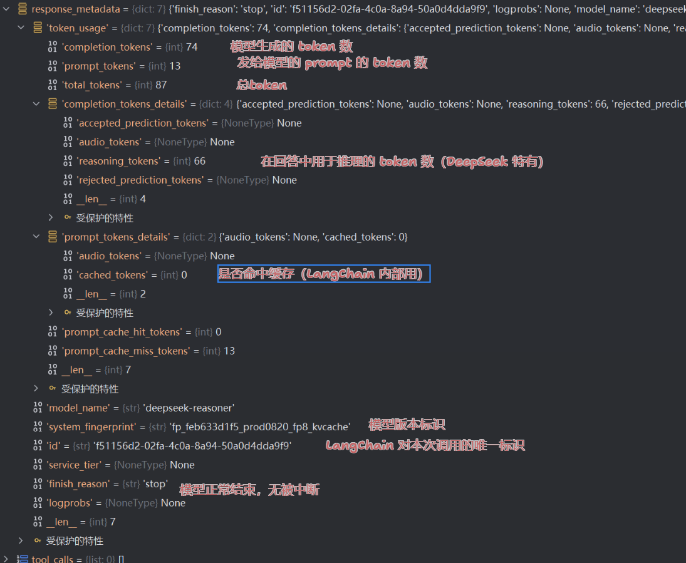
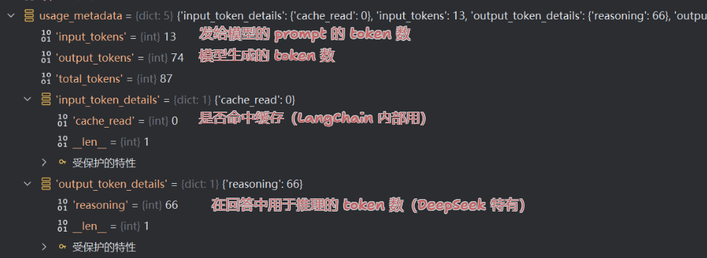
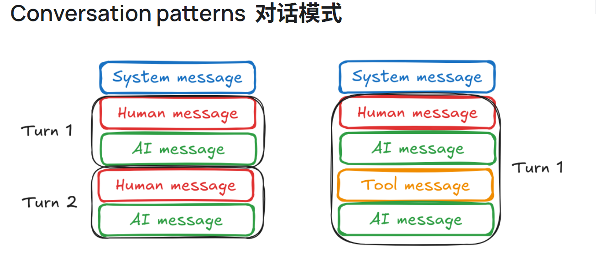

## 一、 安装包
`pip install langchain`  
LangChain ecosystem (langchain的生态系统)
除了 langsmith SDK 之外，LangChain 生态系统中的所有包都依赖于 langchain-core，其中包含其他包使用的基类和抽象。下面的依赖关系图显示了不同包的关系。定向箭头表示源包依赖于目标包： 
<center></center>

**请注意** : 不需要安装包的显示依赖项目，例如（langchain-core）,但是如果想要使用的功能在特定包中还是可以单独安装，但是要确保包与包的兼容  

- `langchain-core` : 最底层核心定义（数据结构、BaseModel、Runnable）。它由 langchain 自动安装，但也可以单独使用。安装方式：```pip install langchain-core``` 
- `langchain-community`:社区组件：加载器(document loaders )、模型、工具、连接器,检索器等
- `langchain-experimental` 包含实验性 LangChain 代码，用于研究和实验用途。
- `langgraph` 是一个库，用于使用 LLM 构建有状态的多参与者应用程序。它与 LangChain 顺利集成，但可以在没有它的情况下使用。
- `langserve` 主要作用将 LangChain 逻辑暴露为 API 端点.LangServe 由 LangChain CLI 自动安装。 如果不使用 LangChain CLI，请使用以下命令进行安装：``` pip install "langserve[all]"```用于客户端和服务器依赖项。或者 ```pip install "langserve[client]``` 对于客户端代码和 ```pip install "langserve[server]" ```服务器代码。 
- `langchain-cli` 命令行工具，用于管理langchain项目  

langchain-cli与langserver的关系

| 对比项       | langchain-cli             | langserve / langserver              |
|:------------:|:-----------------------:|:---------------------------------:|
| 类型         | 命令行工具                | Python 库 / Web 服务框架           |
| 安装         | `pip install langchain-cli` | `pip install langserve`            |
| 功能         | 项目管理、运行、部署      | 本地部署链为 API                    |
| 依赖关系     | 调用 `langserve` 来启动服务 | 被 CLI 调用                        |
| 使用方式     | 终端命令                  | Python 代码中集成 FastAPI          |

## 二、 聊天简单实现

```python
from langchain_core.messages import HumanMessage, SystemMessage
from langchain_core.prompts import ChatPromptTemplate
from lear_langchain.chat_models import init_chat_model
import os

# 1.导入相关配置
# 2. 定义模型
model = init_chat_model(model="deepseek-reasoner", model_provider="deepseek")
# 3. 获取上下文 
message = [
    SystemMessage("请将语言翻译成英文"),
    HumanMessage("今天天气真好")
]
# 4. 获取结果
# -------------直接获取模型回答结果（不是流式输出）-----------
# response = model.invoke(message)
# print(response)
# -------------直接获取模型回答结果（流式输出）-----------
for token in model.stream(message):
    print(token.content, end="|")
```
1. **init_chat_model** 的参数： 
带``*``的是每个模型都有的,不带的表示根据每个的特性有的，下表中也不完整，根据具体模型进行修改

| 参数名                     | 类型          | 默认值                        | 说明                                                |
|-------------------------|-------------|----------------------------| --------------------------------- | 
| *`model`                | `str`       | 必填                         | 模型名称，例如 `deepseek-r1:1.5b`、`deepseek-coder:6.7b`。 |
| *`model_provider`       | `str`       | `"ollama"`                 | 供应商（gpt-4o-mini 供应商是 openai ollama是ollama，同时需要下载相应的支持包langchain-openai，langchain-ollama），如果不写就按照模型名称进行推测   |
| *`temperature`          | `float`     | `0.7`                      | 控制生成文本的随机性，范围为 0 到 1。   |
| *`max_tokens`           | `int`       | `-1`                       | 生成的最大 token 数，`-1` 表示无限制。 |
| `top_p`                 | `float`     | `1.0`                      | nucleus sampling 参数，控制采样范围。 |
| `num_predict`           | `int`       | `-1`                       | 设置生成文本的最大 token 数，`-1` 表示无限制。                     |
| `num_ctx`               | `int`       | `4096`                     | 设置上下文窗口大小，决定模型生成下一个 token 时可用的上下文长度。              |
| `stop`                  | `list[str]` | `[]`                       | 停止词列表，生成遇到时停止。                                    | 
| `streaming`             | `bool`      | `False`                    | 是否开启流式输出。                                         |
| *`base_url`             | `str`       | `"http://127.0.0.1:11434"` | Ollama API 地址。                                    |             
| *`config_prefix`        | `str`       | `None`                     | 配置前缀，用于在配置管理中区分不同模型的参数。                           | 
| *`configurable_fields ` | Union[Literal["any"], list[str], tuple[str, ...]]       |                            |      模型可以改变的参数，如果model未指定，则默认为``("model", "model_provider")``    |
| *`timeout `             |                                                         |                            |等待模型响应的最长时间（秒）                                                   |
| *`max_retries`          |                                                         |                            |  最大请求次数                                                 |
| *`rate_limiter`         |                                                         |                            |     用于间隔请求                                              |

使用案例 见 `2.init_chat_model.py`

model.invoke(message)回答内容解析




usage_metada是LangChain 为模型调用记录的使用统计



## 消息 messages
1. 什么是消息  
消息是聊天模型中的通信单位。它们用于表示聊天模型的输入和输出，以及可能与对话关联的任何其他上下文或元数据。
2. 消息的构成  
**角色**（role）: “用户”、“助手”  
**内容**(content)：消息的内容（例如，文本、多模态数据）。  
**其他元数据**：id、名称、 令牌使用情况和其他特定于模型的元数据。
3. 角色 (role) 

| 角色 (role) |                            描述(description)                            | 案例  |
|:---------:|:---------------------------------------------------------------------:|:---:|
|  system   |                 用于告诉聊天模型如何行为并提供其他上下文。并非所有聊天模型提供程序都支持。                 |SystemMessage(content="你是一名全科医学专家，回答必须专业、简洁。")|
|   user    |                     表示用户与模型交互的输入，通常以文本或其他交互式输入的形式                     |HumanMessage(content="患者，男性，45岁，最近出现胸闷和咳嗽，请问可能是什么问题？")|
| assistant |                          模型的回复，用于返回文本或结构化信息。                          |AIMessage(content="根据症状，可能是心血管问题或呼吸系统感染。建议进一步检查心电图和胸片。")|
|   tool    |   表示调用外部工具或 API 的结果返回。                                                |                                             |

4. 内容（content）  
**SystemMessage** -- 用于启动 AI 模型的行为并提供额外的上下文，例如指示模型采用特定角色或设定对话的基调（例如，“这是关于烹饪的对话”）。 
**HumanMessage** -- 用于用户输入中的内容。  
**AIMessage** -- 用于模型响应中的内容  
**多模态** -- 有关多模态内容的更多信息。 

5. 其他  
**id**:消息的可选唯一标识符。  
**name**: 一个可选的名称属性，允许区分具有相同角色的不同实体/说话者。并非所有模型都支持此功能！  
**metadata** :有关消息的其他信息，例如时间戳、令牌使用情况等。  
**tool calls** :模型发出的调用一个或多个工具的请求> 有关详细信息  
6. 聊天记录 （chat history ） 
<center></center>
由于聊天模型对输入大小有最大限制，因此管理聊天历史记录并根据需要修剪它以避免超出上下文窗口非常重要。（最近新起的contex engineer上下文管理工程）  
处理的过程中保持上图的结构很重要  

<div>
<a  href="https://langchain-ai.github.io/langgraph/concepts/memory/?_gl=1*mm3qhz*_gcl_au*MTM5NTQ0MjQxNS4xNzU2MTk1MDE4*_ga*MTU2MzEyNzY3My4xNzU2MjY0NTYx*_ga_47WX3HKKY2*czE3NTY0NTY0NTYkbzEzJGcxJHQxNzU2NDU4NjE3JGo2MCRsMCRoMA.." target="_blank"> 
怎么管理好记录，内存,上下文还需要进一步的学习，暂时未仔细学习 （最近也新起了 上下文管理工程）
</a>
</div>

<a href="https://python.langchain.com/docs/how_to/trim_messages/" target="_blank">裁剪消息</a>
7. 消息类型：  
StstemMessage:对应系统角色
HumanMessage:对应用户角色
AiMessage:对应助理角色
AimessageChunk:对应助手角色，用于流式响应，支持`+`
ToolMessage:对应工具角色,有AiMessage的属性外还有tool_call_id

    *AIMessage具有的属性：
   - content：内容
   - tool_calls:工具调用详细信息
   - invalid_tool_calls：工具调用失败详细信息
   - usage_metadata ：使用元素据统计，比如token等
   - id:消息唯一标识符,id的优先级：模型提供程序>langchain提供的（以run-开头）>自己创建的
   - response_metadata：效应元数据
## chatModel
- 现代的llm通常是通过聊天模型接口访问,消息列表为输入，消息为输出，其中输出格式有langchian格式和open ai格式    
- 最新的chatModel提供了工具调用、结构化输出、多模态的功能  
- 由于许多模型有最大速率限制，可以通过设置他的最大速率（rate_limiter）和最大重试次数(max_retries)来解决速率限制错误，如果失败可以退回一个不受速率控制的模型，  
- contenx window （上下文窗口）决定了决定了模型在整个对话中可以“记住”多少信息。
- 如果是用于回答常见问题的聊天模型，那么可以使用缓存来减少成本和响应时间以及程序的负载
## 提示模板（prompt templates）
1. 提示模板输出 PromptValue。此 PromptValue 可以传递给 LLM 或 ChatModel，也可以转换为字符串或消息列表。存在此 PromptValue 的原因是为了便于在字符串和消息之间切换。
2. 提示词模板的类型：  
- String PromptTemplates 
用于简单的输出，如只有单个的字符
```python
from langchain_core.prompts import PromptTemplate

prompt_template = PromptTemplate.from_template("Tell me a joke about {topic}")

prompt_template.invoke({"topic": "cats"})
```

- ChatPromptTemplates
```python
from langchain_core.prompts import ChatPromptTemplate

prompt_template = ChatPromptTemplate([
    ("system", "You are a helpful assistant"),
    ("user", "Tell me a joke about {topic}")
])

prompt_template.invoke({"topic": "cats"})
```
- MessagesPlaceholder  消息占位符
```python
prompt_template = ChatPromptTemplate([
    ("system", "You are a helpful assistant"),
    MessagesPlaceholder("msgs")
])
# 需要转换成标准的模板格式
prompt_template.invoke({"msgs": [HumanMessage(content="hi!")]})
# 构建历史消息
messages_to_pass = [
    HumanMessage(content="What's the capital of France?"),
    AIMessage(content="The capital of France is Paris."),
    HumanMessage(content="And what about Germany?")
]
# 填充消息
formatted_prompt = prompt_template.invoke({"msgs": messages_to_pass})
print(formatted_prompt)
```

