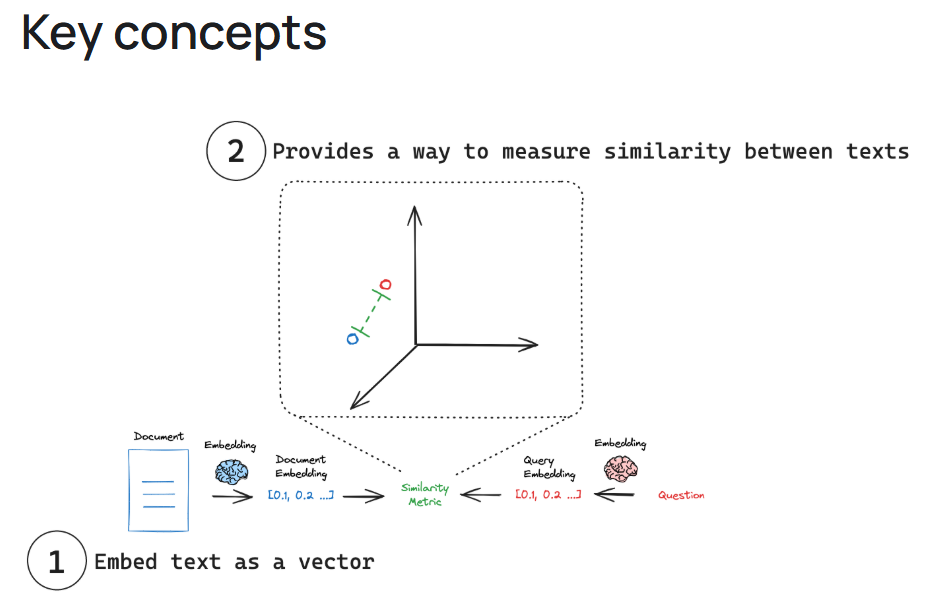

## document
langchain_core.documents.base.Document  
用法: 用于存储一段文本和相关元数据的类。  
参数: 
- id: str 默认None 文档的可选标识符。 这应该在整个文档集合中是唯一的，并格式化为 UUID，但不会强制执行。
- metadata: dict 该文档的相关元数据，如作者、来源、发布日期等。这些元数据可以帮助在处理文档时进行更细粒度的控制或过滤。
- page_content:str[required] 文档的实际内容（文本），通常是从文件、数据库或其他来源提取的。

文本缩减策略（MapReduceDocumentsChain）: 将文本拆分为更小的文档->将流程映射到较小的文档上->将过程的结果减少或合并为最终结果
文本缩减策略:https://python.langchain.com/docs/versions/migrating_chains/map_reduce_chain/

document(检索，切片，es，引文等内容):https://python.langchain.com/api_reference/core/documents/langchain_core.documents.base.Document.html
## 文档加载器（Document loaders）
### 加载pdf 
- pdf 标准化为 ISO 32000，是 Adobe 于 1992 年开发的一种文件格式，用于以独立于应用程序软件、硬件和作系统的方式呈现文档，包括文本格式和图像。 
- 一般而言，pdf解析器是一下的某种组合：
   - 通过启发式（经验）或 ML 推理将文本框聚合成行、段落和其他结构，步骤：
     -  分割
     - 表格、标题、列表识别
     - 缺点：受文本质量的影响、复杂结构文本可能无法识别
     - 优点：可以处理各种文本格式，pdf,word、可以提高文本处理的效率和准确性
   - 对图像使用ocr技术检测文本，步骤：
        - 预处理图像，二值化、去噪等
        - 文字区域检测
        - 字符分割，将图像中的字符单独分割出来
        - 字符识别
        - 字符拼接
        - 后处理，对识别结果进行校正和优化（拼写校正：格式化：结构化输出）
        - 缺点：受文本质量的影响、对复杂字体，手写体支持差、上下文理解不足导致识别出错误字符（看技术和方法）
        - 优点：省力，
   - 将文本分类为段落，列表，表格或其他结构
   - 将文本结构结构化为表行或者键值对
   - 多模态
- 技术  

| 名称                             | 技术原理                  | 优点               | 缺点          | 适用场景        | 支持表格 | 支持图片 |
| ------------------------------ | --------------------- | ---------------- | ----------- | ----------- | ---- | ---- |
| **PyPDF / PyPDFDirectory**     | 解析 PDF 文本层            | 轻量稳定、支持批量加载      | 不支持图像/OCR   | 标准电子说明书     | 否    | 否    |
| **PDFPlumber**                 | 几何定位提取文本/表格           | 精准提取表格、段落清晰      | 图像不支持，稍慢    | 药品成分/用法说明   | 是    | 否    |
| **PDFMiner**                   | 字节流 + 字体级结构分析         | 精细控制、开发灵活        | 使用复杂、新手不友好  | 高级定制解析      | 是    | 否    |
| **PyMuPDF (fitz)**             | 高性能图文提取               | 快速、支持图像和坐标       | 表格识别略弱      | 图文混合说明书     | 是    | 是    |
| **PyMuPDF4LLM**                | PyMuPDF + Markdown 输出 | 自动分段结构、适合 RAG    | 依赖 PyMuPDF  | RAG 输入优化    | 是    | 是    |
| **Unstructured**               | LLM+NLP 结构分析          | 自动分块、智能结构化       | 初期配置复杂      | 文档格式杂乱时     | 是    | 是    |
| **Amazon Textract**            | 云端 OCR + 表格识别         | 精度高，支持扫描件        | 付费 + API 限制 | 扫描药品说明书     | 是    | 是    |
| **MathPix**                    | 数学公式 OCR              | 识别公式强            | 不适合文本提取     | 药理类教材或公式说明  | 否    | 是    |
| **PDFium2**                    | 底层 PDF 渲染             | 渲染强、可视化好         | 无结构提取能力     | 可视化/预览/图像提取 | 否    | 是    |
| **UpstageDocumentParseLoader** | LLM 分块加载              | 适配 LangChain RAG | 文档少、生态小     | RAG 结构化处理   | 是    | 是    |
| **Docling**                    | NLP 分块识别              | 自动结构识别           | 稳定性一般       | 说明书初步语义解析   | 是    | 是    |

最后选择使用miner U ，直接调用方法使用的，发现效率有点低且有部分不准确，后续可以取消画框和不必要的输出，查看是否效率有所提升，若没有则可以考虑自己按照逻辑复现（易于调试，但是工程量较大）

### text spliter 切分
1. 为什么要切分：
- 处理长度不一致的文本
- 克服模型最大输入限制
- 提高表示质量:长文本的注意力会不集中，短文本会更集中
- 提高检索精度：提高搜索结果的颗粒度
- 加快计算
2. 拆分策略
- 基于长度（length-based）  
优点：没有很复杂的逻辑，是一个通用的策略，且每个块的大小一致
类型：   
   - token-base ,根据标记数量拆分文本，这在使用语言模型时很有用。  https://python.langchain.com/docs/how_to/split_by_token/
   - character-base ,根据字符数拆分文本，这可以在不同类型的文本中更加一致。https://python.langchain.com/docs/how_to/character_text_splitter/   
- 基于文本结构 ：
定义：（就是基于停止词的）文本自然地组织成分层单元，例如段落、句子和单词。我们可以利用这种固有结构来指导我们的拆分策略，创建保持自然语言流的拆分，在拆分中保持语义连贯性，并适应不同级别的文本粒度 ,`langchain_text_splitters`包中` RecursiveCharacterTextSplitter `  
具体解析：https://python.langchain.com/docs/how_to/recursive_text_splitter/  
- 基于文档结构
定义：某些文档具有固有结构，例如 HTML、Markdown 或 JSON 文件。在这些情况下，根据文档的结构拆分文档是有益的，因为它通常会自然地对语义相关的文本进行分组
优点：保留文档逻辑，维护每个快的上下文，对于检索或汇总等下游任务可以更有效  
案例：
 - json: `RecursiveJsonSplitter`https://python.langchain.com/docs/how_to/recursive_json_splitter/
 - md:`MarkdownHeaderTextSplitte`https://python.langchain.com/docs/how_to/markdown_header_metadata_splitter/
 - html:https://python.langchain.com/docs/how_to/split_html/
 - 代码：https://python.langchain.com/docs/how_to/code_splitter/

-  基于语义(Semantic meaning based )

## embeddings
定位：是能够快速找到相关文档的核心
解释:将人类语言转化为机器可以理解和比较的格式。
特点：
- 文本转为向量，每个向量代表文本的语义信息
- 固定长度，每个向量的长度是固定的，因此可以进行对比
- 语义表示，向量包含了文本的语义信息，例如，情感，意图，主题等
- 相似度计算，由于长度相同，因此可以用简单的公式进行计算两个向量的相似性

下图展示了嵌入和检索的基本逻辑，

## 稠密向量
稠密向量的维度较低，但信息量大，所有维度均为非零值。这种向量通常由 BERT 等模型生成，常用于基于语义相似性而非仅仅是关键词匹配来排序结果的语义搜索任务。
## 稀疏向量
传统的稀疏向量，常用于语言处理领域，其特点是高维且多数维度值为零。这些维度通常代表一个或多个语言中的不同标记，非零值则显示了该标记在特定文档中的相对重要性。例如，BM25 算法生成的稀疏向量通过增加一个术语频率饱和函数和长度规范化因子，对 TF-IDF 方法进行了改进，因此非常适合执行关键词匹配任务。
### bge-m3

### embedding 和 分词器（tokenizer）的区别

## 向量数据库
milvus
###初始化
参数类别	核心参数	作用与配置原则
连接配置	connection_args	配置 Milvus 服务地址、端口等，必填。本地部署与云服务配置不同。
向量生成	embedding_function	文本转向量的函数（如 OpenAIEmbeddings），必填。需与向量维度匹配。
集合配置	collection_name	集合名称（类似表名），自定义（如 "medical_knowledge"）。
索引与检索	index_params	向量索引类型（影响检索速度），根据数据量选择（如 FLAT/IVF_FLAT/HNSW）。
索引与检索	search_params	检索参数（与索引类型匹配），如nprobe（IVF 索引）、ef（HNSW 索引）。

### FieldSchema

milvus中HNSW索引查询时efSearch参数设置

| 数据规模           | Top-K   | 推荐 efSearch | 备注                      |
| -------------- | ------- | ----------- | ----------------------- |
| 小规模 (<100k)    | 10\~100 | 50\~100     | efSearch 可以略小，FLAT 精度接近 |
| 中规模 (100k\~1M) | 10\~50  | 100\~200    | 平衡精度和速度                 |
| 大规模 (>1M)      | 10\~50  | 200\~500    | 数据量大，需要更大 efSearch 保证精度 |
经验公式（Milvus 官方推荐）：
efSearch≈2∼4×K
- K = Top-K 查询结果数量
- 数据量大时可以适当增加 1~2 倍
调优建议：
- 从默认值开始：Milvus 默认：efSearch = 64（HNSW）
- 先调精度：逐步增大 efSearch，观察 recall 提升幅度
- 测延迟：efSearch 越大，查询延迟越高
- 对不同 Top-K 值独立调节：Top-1、Top-10、Top-50