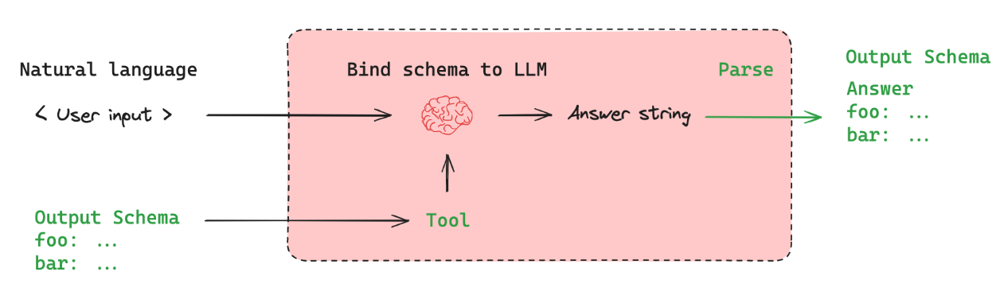

# ChatModel
## 1.定义
是对大语言模型（LLM）的统一封装，支持多轮对话，消息结构化输入等，其中最新的聊天模型提供了工具调用，结构化输出，多模态能力
## 特征
- 消息格式有，langchain的消息格式和openai的消息格式
- 标准的工具调用api
- 通过`with_structured_out_put` 构建结构化的输出
- 支持异步编程，高效批处理，和丰富的六十处理api
- 与langsmith继承，方便监控和调试
- 其他功能，如标准化令牌使用，速率限制，缓存等

### 接口（interface）
- chatModel实现了BaseChatModel接口，而BaseChatModel又实现了Runnable接口因此chatModel支持 streaming流式传输接口，异步编程等。  
请注意：自定义chatModel时应该继承BaseChatModel
- chatModel提供标准参数用于配置模型的行为，比如温度，等待时间等

### chatModel主要方法
`model.invoke` : 与聊天模型交互的主要方法。它将消息列表作为输入，并返回消息列表作为输出
`model.stream` : 流式输出  
`model.batch`  : 允许将批量处理处理到一个聊天模型，以便高效的处理    
`model.bind_tools` : 给模型绑定工具  
`with_structured_output` : 结构化输出  
`with_retry`   : 失败时重试调用模型  
`with_fallbacks` : 失败时调用其他模型  
[其他方法和参数 ](https://python.langchain.com/api_reference/core/language_models/langchain_core.language_models.chat_models.BaseChatModel.html)

### 输入输出
都是消息
1. 消息的格式  
- LangChain格式： 

- OpenAi格式:
````python
chat_model.invoke([
      {
          "role": "user",
          "content": "Hello, how are you?",
      },
      {
          "role": "assistant",
          "content": "I'm doing well, thank you for asking.",
      },
      {
          "role": "user",
          "content": "Can you tell me a joke?",
      }
  ])
````
### 提供的部分标准参数
`model`  : 模型的名称  
`temperature` : 0-1,越高，模型输出的随机性就越高  
`timeout` : 多久未响应则取消请求  
`max_tokens` : 限制响应中的标记总数（单词和标点服啊后），用于控制输出的长度  
`stop` : 模型输出的停止词
`max_retries` : 如果请求因网络超时或速率限制等问题而失败，系统将尝试重新发送请求的最大次数。  
`api_key` : 密钥  
`base_url` : 请求发送的地址，比如ollama,dify等部署的模型
`rate_limiter` : 间隔请求以避免超出速率限制  
**注意**：只在langchian-模型名称的包中生效，在langchian-comminity中不一定生效，且每个模型的参数可能不一致
### 上下文窗口（Context）
输入如果超出上下文窗口，则模型可能无法处理整个输入，并且可能引发错误。而上下文决定了模型能够记住多少信息，因此需要管理上下文窗口，保证连贯的对话且不超出限制  
输入大小的衡量标准是，token
### 速率限制
遇到解决方案1：等待后重新发送 2.切换另外一个模型

### 缓存 
看业务，如果第一次第二次对话不相同，则缓存基本没用
另外一个方案是语义缓存，但只在常用聊天模型中效果较好，


### 调用模型方式
`1. 加载chatModel.py`
看使用场景，一般使用init_chat_model比较方便，但对langchain-模型名的参数是否支持，还待验证
### 工具调用
`4.绑定工具.py` 
虽然模型可以自己选择调用工具，但也有强制指定调用，我们还可以通过将“any”（或 OpenAI 特定的 “required”）关键字传递给 tool_choice 参数来强制我们的工具选择至少一个工具。
```python
llm_forced_to_multiply = llm.bind_tools(tools, tool_choice="multiply")
llm_forced_to_multiply.invoke("what is 2 + 4")
```
**小技巧**： 调用工具是根据函数的名称和注释进行选择的因此，需要写好函数解释信息

### 结构化输出with_structured_output()

注意，有工具时先绑定工具，再进行绑定结构化输出的模板，其次虽然可以使用工具的方法进行绑定，但是输出是所有输出都需要，因此使用with_structured_output稳妥，（可以用来做后面的联想词）  
pydantic`5.结构化输出pydantic ` 和 TypedDict `6.结构化输出TypedDict` 的主要区别在于pydantic如果缺少字段（匹配不上）会引发错误  
`8.多个结构化输出的选择`没有成功，原因可能在于现在模型比较强大，可以使用工具代替
他会根据问题进行选择性的使用定义的结构化输出，但是要格式要一致，json的不能与其他混用(如果模型支持工具调用则使用工具调用，会提高性能)


### 

