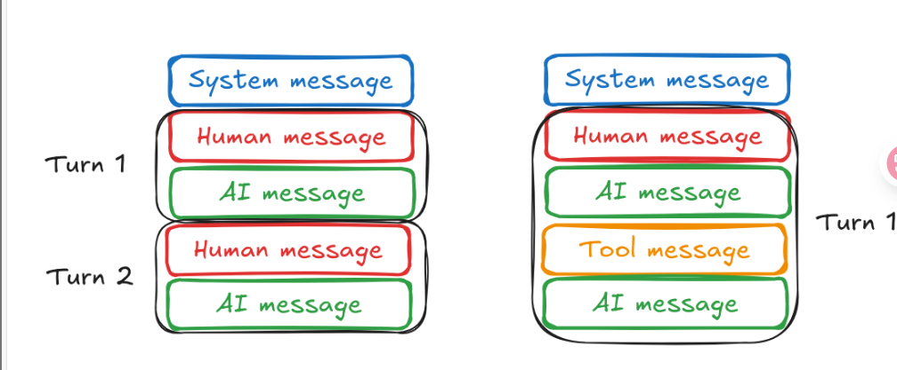

## Chat History

### 1. 定义 
聊天记录是用户与聊天模型之间对话的记录。它用于在整个对话中维护上下文和状态。聊天历史记录是消息序列，每个消息都与特定角色相关联，例如“用户”、“助手”、“系统”或“工具”。
### 2. 对话模式

大多数的对话都是以系统消息开始，以ai的消息结束。如果模型不支持就是用户消息开始。如上图中左图所示  
如果有调用工具则如同上图中右边部分所示，
### 3. 管理聊天历史
1. 管理聊天记录并根据需要修剪来避免超出上下文窗口很重要
2. 处理过程中，一定要保留正确的对话结构：
    - 第一条消息是`用户`或者`系统`消息，然后是用户，紧跟着是ai助手的消息
    - 最后一条应该是`用户`或者包含工具调用结果的`工具`消息（有疑问，不应该是ai回答的消息嘛）
    - 使用工具调用时，tool应该紧跟着ai消息
### 消息裁剪
1. 使用的方法`trim_message` 将聊天历史记录的大小减少到指定的令牌数或者消息数，不会改变原来的历史记录，是返回结果
2. 如果要将裁剪后的消息直接传给聊天模型，应该满足：
   - 结构要求：
      - 以HumanMessage或SystemMessage开头，后跟HumanMessage
      - 以HumanMessage或ToolMessage结尾  
      - ToolMessage只能出现在涉及工具调用AIMessage之后  
     <div>
     这些要求可以通过`start_on = "human" 和 ends_on("human","tool")`实现 </div>
     <div>
     最后是HumanMessage的原因在于这条消息是用胡提出的问题，给ai让他回答。最后是tool的原因是：模型说：我要调用工具 → 工具执行 → 返回结果 → 现在轮到 AI 回应
     </div>
     
     ```python
     [
     HumanMessage(content="查询阿司匹林的作用"),
     AIMessage(content="[调用工具 get_drug_info(name=阿司匹林)]"),
     ToolMessage(tool_call_id="xyz", content="阿司匹林是一种解热镇痛药..."),
     # 模型现在需要基于工具结果给出回答 ⇒ 下一条才生成 AIMessage
     ] 
     ```

   - 最近消息中删除就消息，可以设置`strategy="last"`实现  
   -  SystemMessage不应该删除，因为 SystemMessage 包含对聊天模型的特殊说明，可以通过`include_system =True`实现
##### 基于令牌（token）计数的裁剪
1. 为了保留最新的消息，我们设置了 strategy=“last”。我们还将设置 include_system=True 以包含 SystemMessage，并设置 start_on=“human” 以确保生成的聊天记录有效。
2. 根据需要调整token_counter和max_tokens,其中，token_counter可以传入函数或者语言模型（语言模型有一个消息token计数方法）

##### 基于消息裁剪
1. 设置 token_counter=len 根据消息计数修剪聊天记录，max_tokens控制最大消息数

总结：1. 令牌和消息裁剪的不同之处在于令牌计数器token_counter的不同