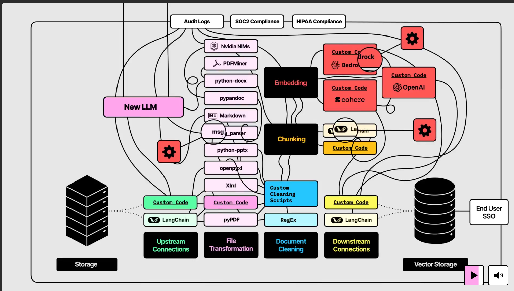

## 文档加载器

### 什么是文档加载器

通过各种手段，把各种格式的文件（pdf,word,excel,png）等进行解析，形成md，json等格式

### 特点
如果他是继承自BaseLoader，那么提供load,aload,alazy_load,lazy_load,load_and_split方法，在处理大型数据集时，推荐使用.lazy_load

### 整个流程

**总结** ：从多种文件获取 → 文档解析 → 清洗 → 分块 → 向量化 → 存储 → 检索 → 用户访问

### 水印处理
##### 水印类型
1. 图片型 ： logo,二维码 ， 可以使用PyMuPDF删除指定的尺寸图像
2. 背景图水印， 一个大图最为背景图插入， 通过检测大尺寸图像移除
3. 文字型，使用 Text 对象插入的文字，如“Confidential”，用 get_text("dict") 定位 + redact 删除
4. 向量图层水印，PDF 中的矢量图形，构成水印文字或标志，
5. 嵌入在图像中的水印，原始扫描图像中嵌入水印（不可分离）
